# taskmaster
Create Home activity for TaskManger with two buttons Add Tasks will take yuo to AddTasks activity and All Tasks button to AllTasks activity
and in each parent activity we have back arrow to the parent

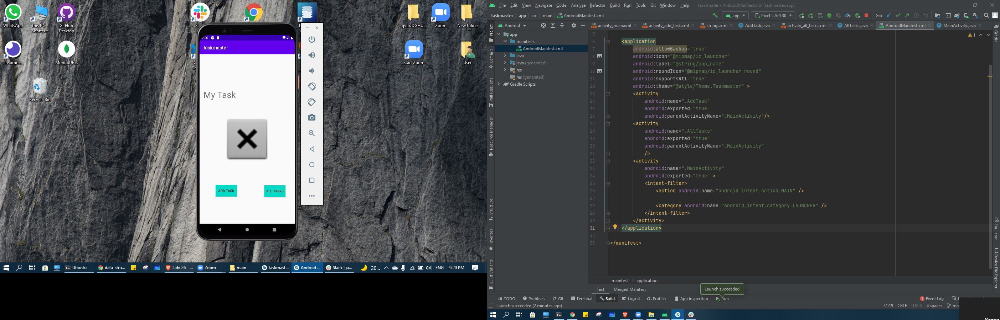
.png)
.png)

# lab27

## add the ability to send data among different activities in your application using SharedPreferences and Intents.

# Create a Task Detail page
# Create a Settings page.
# add 3 button for tasks.

.png)

# lab28

##  refactor the homepage , add a RecyclerView .

# Create  a Task class it have a title, a body, and a state
# add RecyclerView to the home page and displaying Task data
# create ViewAdapter that displays data from a list of Tasks
# can tap on Tasks in the RecyclerView,
 and it will appropriately launch the detail page with the correct Task title displayed.

#lab29

# add database store to Task data in a local database.
#  add Room in  application, and modify Task class to be an Entity.
# Add Task form to save the data entered in as a Task in your local database.
#   connect the RecyclerView to display all Task entities in your database.

## Lab: 31 - Espresso and Polish:

1. Espresso Testing : Add Espresso to your application, and use it to test basic functionality of the main components of your application

2. Polish : Complete any remaining feature tasks from previous days’ labs.

## Lab 32 :
* Using the amplify add api command, create a Task resource that replicates our existing Task schema. Update all references to the Task data to instead use AWS Amplify to access your data in DynamoDB instead of in Room.
* Modify your Add Task form to save the data entered in as a Task to DynamoDB.
* Refactor your homepage’s RecyclerView to display all Task entities in DynamoDB.
  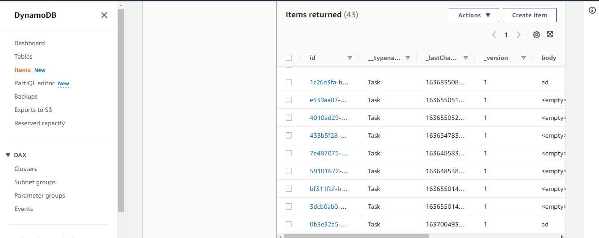
  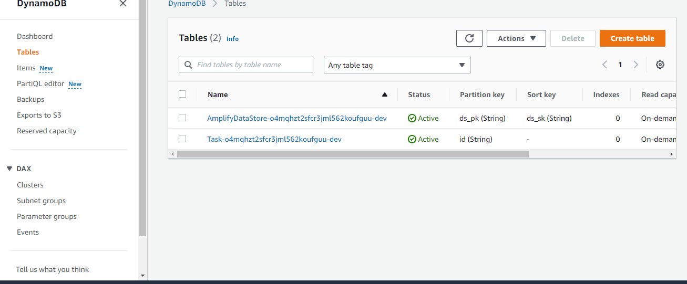
  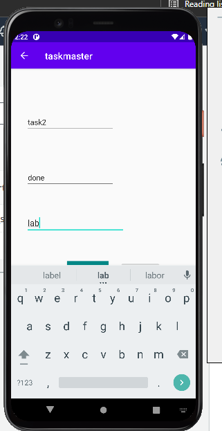
  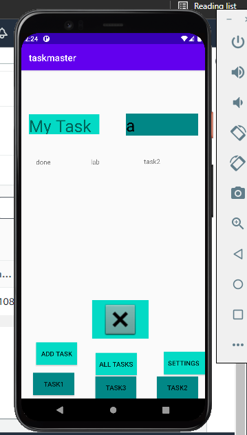
  

## lab33 : 

In this lab I created a second entity for a team, 
which has a name and a list of tasks. So, tasks will be Updated to be owned by a team.
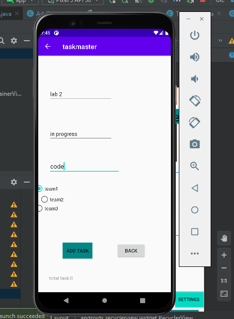
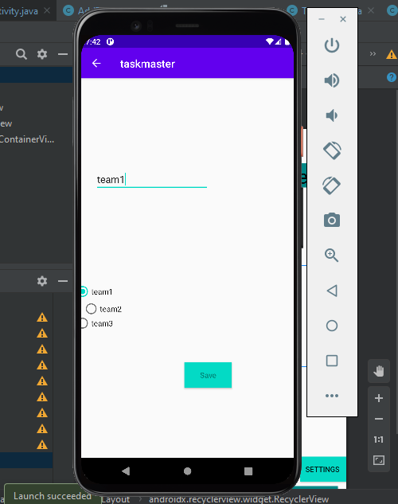
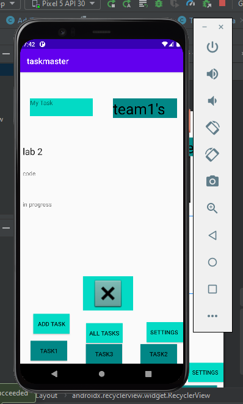
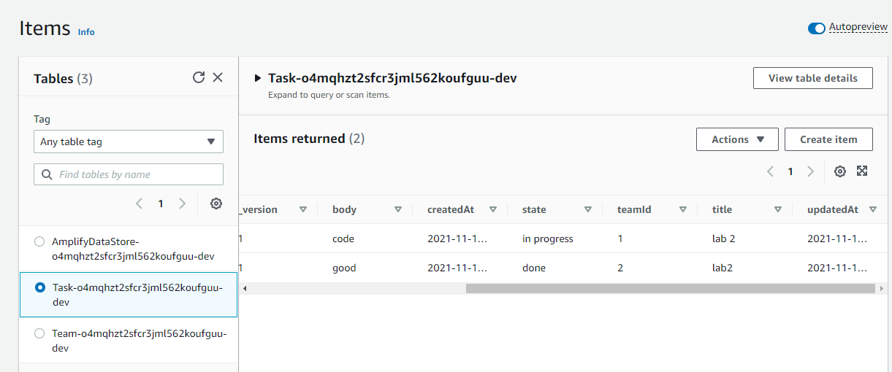

# Lab 34: Publishing to the Play Store

## ## Lab 36: Cognito

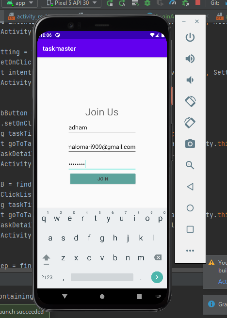
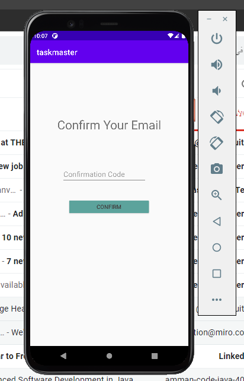
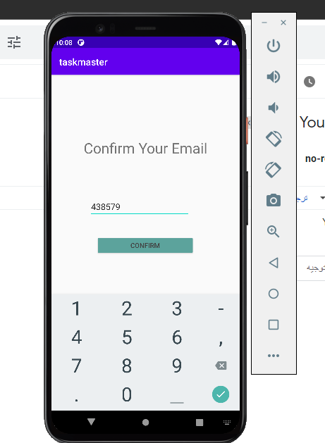
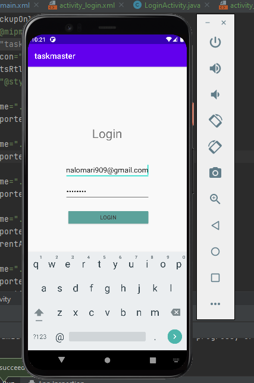
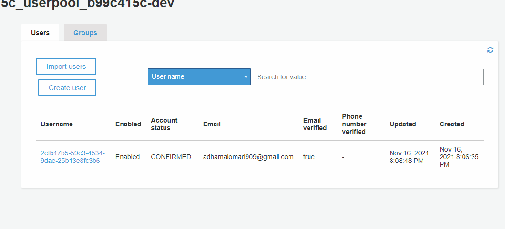

