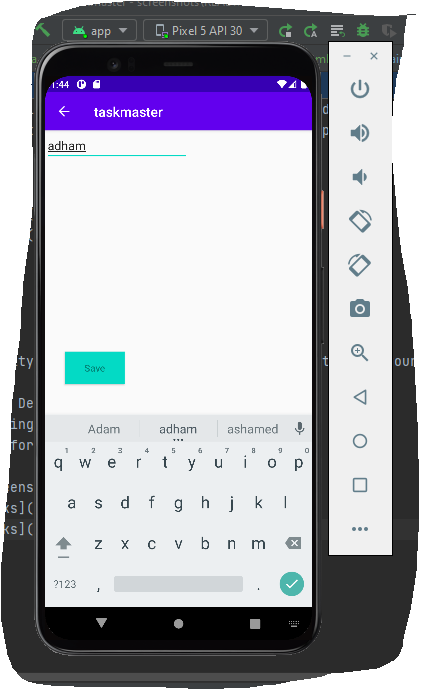
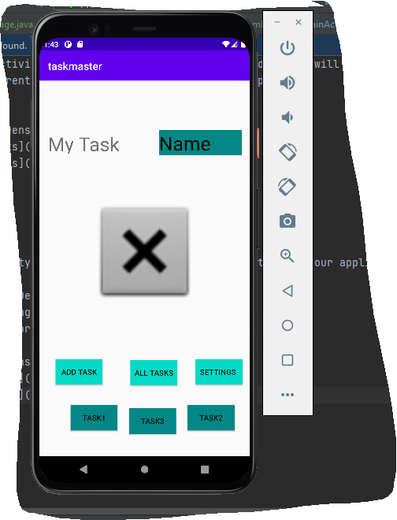
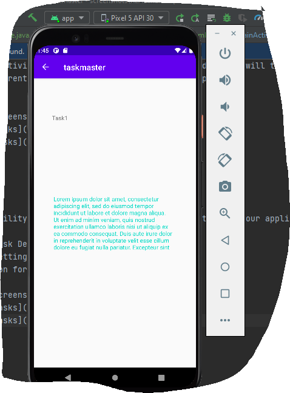
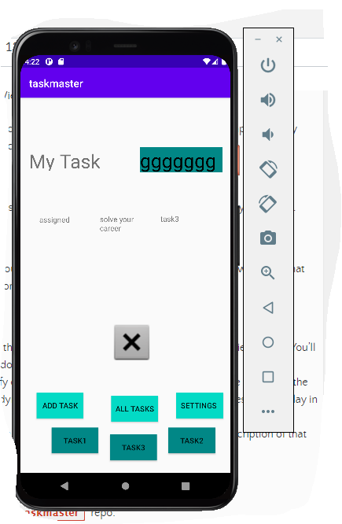
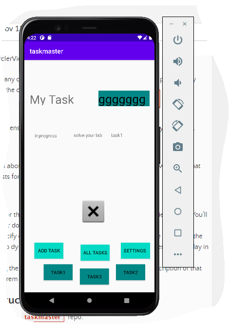
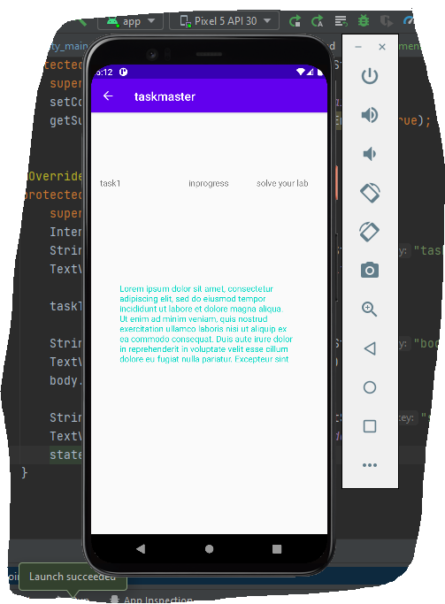

Create Home activity for TaskManger with two buttons Add Tasks will take yuo to AddTasks activity and All Tasks button to AllTasks activity
and in each parent activity we have back arrow to the parent

.png)
.png)

# lab27

## add the ability to send data among different activities in your application using SharedPreferences and Intents.

# Create a Task Detail page
# Create a Settings page.
# add 3 button for tasks.

.png)

# lab28

##  refactor the homepage , add a RecyclerView .

# Create  a Task class it have a title, a body, and a state
# add RecyclerView to the home page and displaying Task data
# create ViewAdapter that displays data from a list of Tasks
# can tap on Tasks in the RecyclerView,
 and it will appropriately launch the detail page with the correct Task title displayed.

